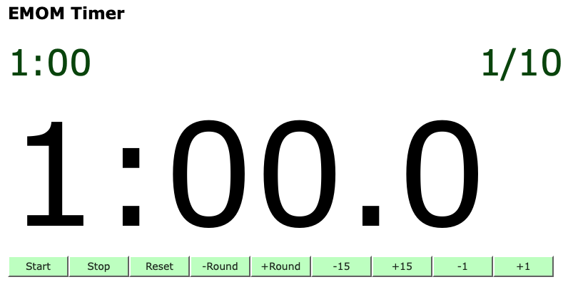

# EMOM Timer

[](https://github.com/jac18281828/emomtimer/actions/workflows/ci-image.yml)

[](http://emom-timer-us-east-2-504242000181.s3-website.us-east-2.amazonaws.com)

# Customizable timer for your workout!

This is a customizable timer written with Rust and Yew.   

# Introduction

Yew is a modern Rust framework for creating multi-threaded front-end web apps using WebAssembly. It's comparable to JavaScript frameworks like React or Vue.js, but with the performance and safety benefits of Rust. Here are the key aspects of Yew:

1. **WebAssembly**: Yew compiles to WebAssembly (Wasm), enabling web applications to run at near-native speed. This makes Yew a powerful choice for performance-critical web applications.

2. **Component-Based**: Like React and Vue, Yew uses a component-based architecture. This makes it easier to build complex interfaces, as the UI is broken down into independent, reusable components.

3. **Rust Programming Language**: Leveraging Rust's performance and safety features, Yew ensures memory safety and thread safety, minimizing common web development bugs like memory leaks.

4. **Concurrent and Multi-Threaded**: Rust's support for concurrency and Yew's design allow for multi-threaded applications. This can lead to better performance, especially on modern multi-core processors.

5. **JS Interoperability**: Yew can interoperate with JavaScript, allowing developers to use existing JavaScript libraries and frameworks alongside Yew.

6. **Rich Tooling and Ecosystem**: Yew benefits from Rust's tooling, such as Cargo for package management, and an active community contributing to its ecosystem.

7. **Virtual DOM**: Like React, Yew uses a virtual DOM to optimize rendering. It only updates the parts of the real DOM that have changed, leading to efficient rendering and improved performance.

8. **Declarative UI**: Yew embraces a declarative approach to defining UI, which can make code more readable and easier to reason about compared to imperative UI coding.

9. **Macro-based Syntax**: Yew uses Rust macros to provide a JSX-like syntax, making it familiar for developers coming from a React background.

10. **Strong Type System**: Leveraging Rust’s strong type system, Yew applications benefit from compile-time error checking, which can catch errors early in the development process.

Yew is particularly suited for applications where performance, reliability, and Rust's strong type system are important. However, it does require familiarity with Rust, and the ecosystem is not as mature as JavaScript's, which could be a consideration for some projects.

### Quick Start

#### VSCode

`Reopen in container`

#### Build Trunk

```bash
$  trunk build --release
```

#### Serve Trunk

```bash
$  trunk serve --address=0.0.0.0 --release
```
